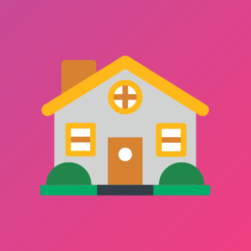
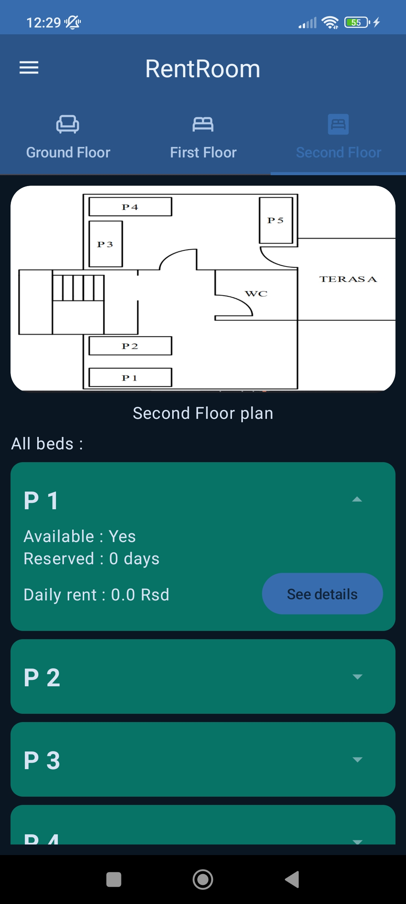
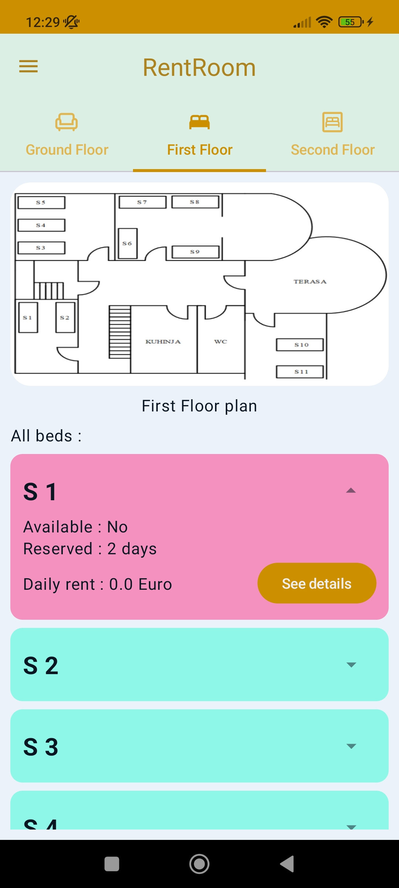
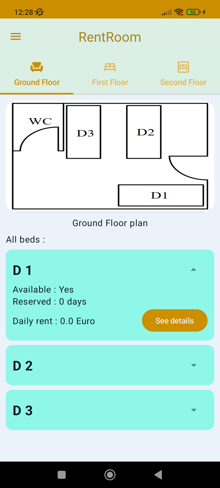
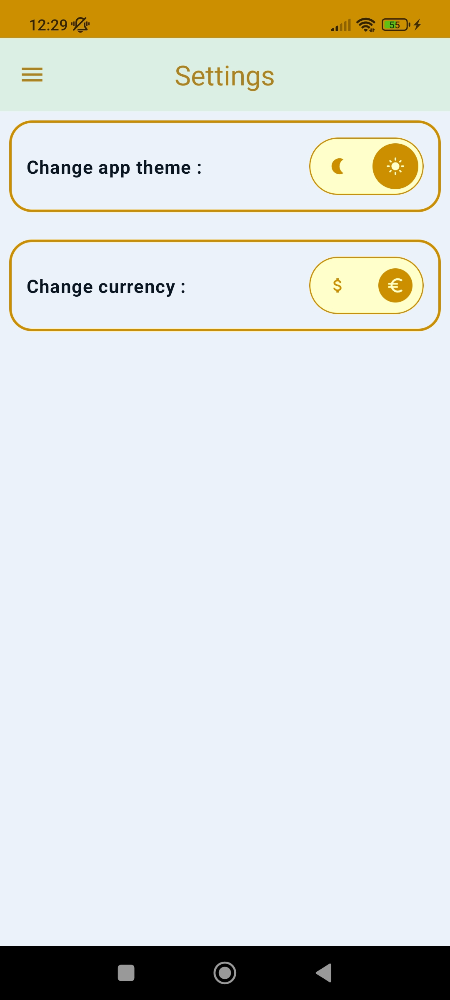
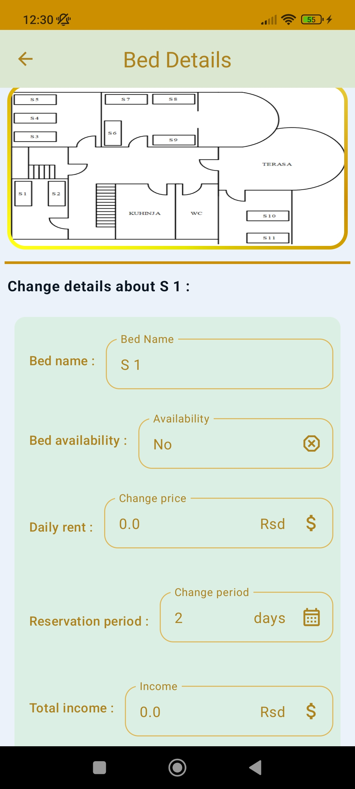
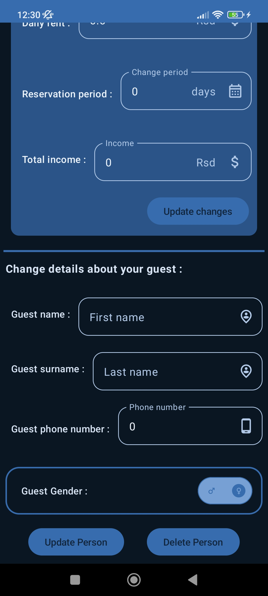
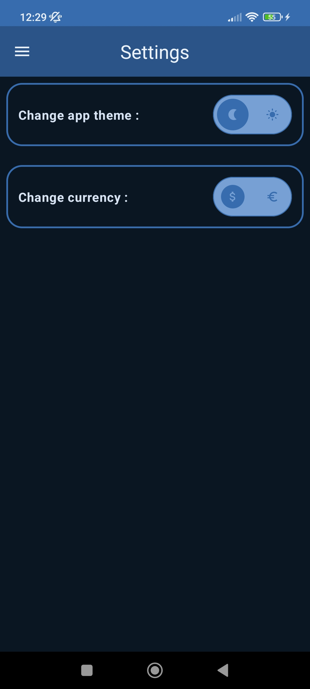

  <a href="https://harmonic.app">
    
    <h1 align="center">RentRoom 🏠</h1>
  </a>

  
  

## 📱 Screenshots
### App Themes
|  |  | 
|:---:|:---:|
|Dark theme| White theme|

### Navigation screens
| | | | | |
|:---:|:---:|:---:|:---:|:---:|
| Home | Settings | Bed Details | Bed Details(Dark) | Settings(Dark) |

## 🧭 Navigation never been made easier 
Self-explanatory interface without overloaded menus.

## 🎨 Colorful
You can choose between two different main themes: White and Dark.

## 🏠 Home
Where you can view your floor plans and check informations about every bed on that floor.

## 💡 Details
Where you can check all details about bed and person who stays there.

## 📦 Included Features
-  Base 2 themes (White,Dark)
-  Splash screen
-  Animations while navigating
-  Animated drawer
-  Persistent database
-  Settings screen
-  Changing currency of rent
-  Multiple floors with beds
-  Plan image for every floor
-  Details about bed
-  Details about persons who stays in house
-  Changing data for beds and persons
-  Removing person from bed

## 👨‍💻 Used technologies
-  Kotlin programming language
-  Jetpack Compose
-  Kotlin Flow
-  Kotlin coroutines
-  Room library
-  Dagger Hilt(dependency injection)
-  Coil(image loading library)
-  Clean architecture
-  MVVM design pattern
-  Use cases
-  Material 3 design
-  Splash screen API
-  Compose navigation
-  R8
